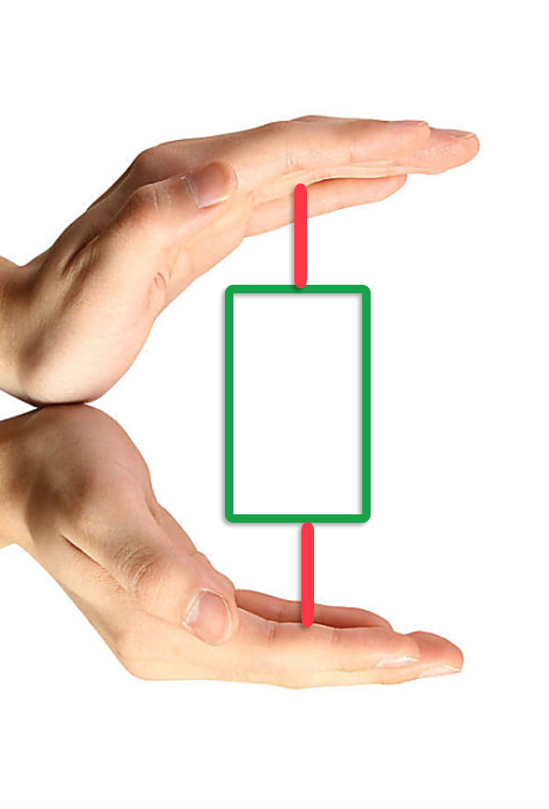
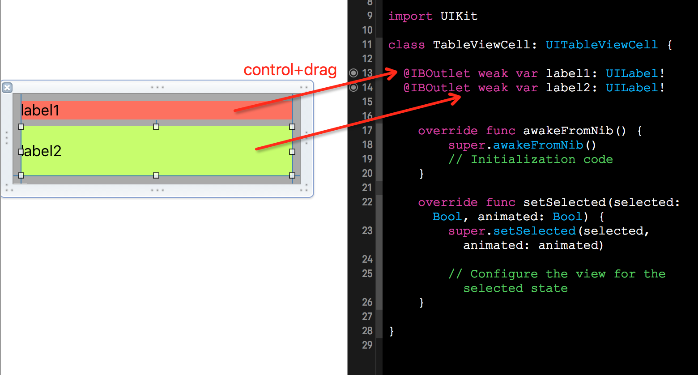

# Using Auto Layout in UITableView for dynamic cell layouts & variable row heights


# Inferface Builder:Storyboard & Xib


## AutoLayout   

### 原理讲解

自定义 TableView Cell 核心思想是继承`UITableViewCell`，往其 ContentView 中增加子视图来实现，譬如自定义一个带标题，图片以及文本描述的单元格：


注意到子视图与cell中的 ContentView 边界建立了约束关系，**其中两者之间的top、bottom约束尤为重要**。

> **注意：绝对不要在子视图和cell自身之间建立约束，cell中的`contentView`才是正确的选择！**

类似`UILabel`、`UIButton`、`UIImage`等都具有固有属性（intrinsic content size），可以通过控件内容（譬如label中的文字）来调整自身的宽和高，固有属性约束的优先级最低（TODO:优先级数值待补），导致当有其他约束（通常优先级为1000）作用在控件上且与固有属性约束起冲突时，前者 Win，约束生效!

如上图所示，Cell 根据子视图的固有属性来**调整**自身高度，取决于显示图片的大小和文本内容。

**问题：**就算Cell知道内部所有子视图的固有属性，它又如何“聪明”地计算出整个 Cell 的高度呢？    
**回答：**首先 Cell 的水平宽度为 tableview 宽度，因此只考虑竖直方向上，通常其中一个子视图会与ContentView的Top建立约束，告诉Cell约束开始；接着子视图在水平方向上相关约束关联；最后总有且一定要有某个子视图与ContentView的Bottom建立约束，告诉Cell约束结束。



图中双手为Cell中ContentView的Top上边界和Bottom下边界，绿色为具有固有属性的控件，会随着内容的变化而调整自身大小，红色为固定约束。双手的闭合（扩张）程度会随着绿色控件的变化而变化，但是如果下方的红色约束缺失，那么就无法再感受双手间内容的大小。


### 使用 Xib 自定义TableViewCell

Storyboard 和 Xib 使用相似，本文以后者为例，首先在 Xcode 上方导航栏按 File->New->File... 打开新文件创建面板，在左侧 iOS 栏选中 Source，接着右侧面板选中 Cocoa Toucch Class 点击 Next。


确保选中“Also create XIB file”选项，点击 Next 创建 TableViewCell.swift 以及 TableViewCell.xib 文件，选择保存文件路径即可。

选中 TableViewCell.xib 文件，设置并确保以下几点：

1. Identity Inspector 面板(快捷键option+command+3) Custom Class 中的 Class 为 `TableViewCell`；
2. Attributes Inspector 面板(快捷键option+command+4)的 Identifier 设置为 **MyCell**；
3. Size Inspector 面板(快捷键option+command+5) 中设置 Height = 100，这里设置高度随意，仅仅只是为了更好地显示 cell 中的内容。

往 Cell 中拖入两个 UILabel，分别为 label1 和 label2，请设置它们的Lines属性为0，表示可以多行；接着设置约束，如下：


灰色为 Cell 自带的 **Content View**，label1 与 Content View 约束包括 Top = 8，Leading = 8，Trailing = 8；同样 label2 和 Content View 的约束包括 Bottom = 8，Leading = 8，Training = 8；最后 label1 和 label2 之间具有一个 Vertical Spacing = 8。这些间距数值都可自定义，不必过于苛求。


> 选中 Content View 并 Update Frames，倘若出现红色错误关于“set vertical hugging priority...”以及“set vertical compression resistance...”问题，点击红色按钮，选中change priority即可。更多有关`Content Hugging Priority` 和 `Content Compression Resistance Priority`知识将在之后补充。




接着我们将 xib 中需要填充内容的控件关联到 TableViewCell 类中，生成 `@IBOutlet`。

>NOTE: 由 xib 创建的 UITableViewCell 自定义Cell，需要向 `tableview` 进行注册。

最后完整代码如下：

```swift
class MyTableViewController: UITableViewController {

  let fakeData :[Dictionary<String,String>] = [
    // 第一个cell 内容开始
    ["label1":"My Name is Label1",
     "label2":"My Name is Label2，My Name is Label2，My Name is Label2，My Name is Label2，My Name is Label2，My Name is Label2，My Name is Label2，My Name is Label2，My Name is Label2，My Name is Label2，My Name is Label2，My Name is Label2"],
    
    // 第二个cell 内容开始
    ["label1":"My Name is Label1，My Name is Label1，My Name is Label1，My Name is Label1，My Name is Label1，My Name is Label1，My Name is Label1，My Name is Label1，My Name is Label1，My Name is Label1，My Name is Label1，My Name is Label1，My Name is Label1，My Name is Label1",
      "label2":"My Name is Label2"]
  ]
  
  override func viewDidLoad() {
    super.viewDidLoad()
    
    // 以下两个都是必须条件
    self.tableView.rowHeight = UITableViewAutomaticDimension;
    self.tableView.estimatedRowHeight = 44.0;
    // 注册Cell Identifier为"MyCell" 和 xib 中的保持一致
    tableView.registerNib(UINib(nibName: "TableViewCell", bundle: nil), forCellReuseIdentifier: "MyCell")
  }
  // MARK: - Table view data source
  override func numberOfSectionsInTableView(tableView: UITableView) -> Int {
      return 1
  }
  override func tableView(tableView: UITableView, numberOfRowsInSection section: Int) -> Int {
      return 2
  }

  override func tableView(tableView: UITableView, cellForRowAtIndexPath indexPath: NSIndexPath) -> UITableViewCell {
    let cell = tableView.dequeueReusableCellWithIdentifier("MyCell") as! TableViewCell
    
    let itemdic = fakeData[indexPath.row]
    cell.label1.text = itemdic["label1"]
    cell.label2.text = itemdic["label2"]
    return cell
  }

}
```

`UITableViewAutomaticDimension`已经目前已经支持iOS5及以后，所以不用再担心兼容的问题。

上述做法实现了单个Cell配备一套约束，使用一个独一无二的 cell 重用标示符。换句话说，当项目样式要求多于一套约束方案时，可创建多个不同重用标示符的 Xib Cell 来实现。

> 千万不要为重用池中同一个Identifier的Cell进行以下操作：移除旧的约束，再设置新的约束！记住 Auto Layout 内部引擎并不是为了处理大规模约束变化，这样做会引发巨大的性能问题。

## StackView

StackView 是 iOS8 新加入的特性，可以通过简单的步骤就能达到视图布局。通常只需将子视图作为arrangedView 加入到 StackView ，选择坐标轴Axis为水平或竖直，接着配置Alignment，Distribution 和 Spacing 等属性，剩下的交由StackView来为你自动生成约束。

请按照上面例程中方式新建一个Xib文件，命名为StackViewCell，Identifier为“StackViewCell”。

选中StackViewCell.xib文件，在Cell的ContentView中拖入2个UILabel，请设置它们的Lines属性为0，表示可以多行。如下：


使用 command + 鼠标左击同时选中label1和label2，点击下图中红色方框按钮为label1和label2创建一个StackView：


>NOTE: 当按照Option按键在鼠标左击按钮时，会弹出Unembed选项！

现在请选中 StackView，建立其与Contentview的约束，分别为top、leading、bottom 和 trailing 距离都为8。当提示有关`Content Hugging Priority` 和 `Content Compression Resistance Priority`报错，按修复即可。

接着请效仿上例中的步骤，将两个label关联到StackViewCell中。修改 MyTableViewController.swift 内容，对新xib cell的注册。此外奇数单元格采用旧布局方式，偶数单元格采用StackViewCell布局方式。最后代码如下：

```swift
class MyTableViewController: UITableViewController {

  let fakeData :[Dictionary<String,String>] = [
    // 第一个cell 内容开始
    ["label1":"My Name is Label1",
     "label2":"My Name is Label2，My Name is Label2，My Name is Label2，My Name is Label2，My Name is Label2，My Name is Label2，My Name is Label2，My Name is Label2，My Name is Label2，My Name is Label2，My Name is Label2，My Name is Label2"],
    
    // 第二个cell 内容开始
    ["label1":"My Name is Label1，My Name is Label1，My Name is Label1，My Name is Label1，My Name is Label1，My Name is Label1，My Name is Label1，My Name is Label1，My Name is Label1，My Name is Label1，My Name is Label1，My Name is Label1，My Name is Label1，My Name is Label1",
      "label2":"My Name is Label2"]
  ]
  
  override func viewDidLoad() {
    super.viewDidLoad()
    
    self.tableView.rowHeight = UITableViewAutomaticDimension;
    self.tableView.estimatedRowHeight = 44.0;
    
    tableView.registerNib(UINib(nibName: "TableViewCell", bundle: nil), forCellReuseIdentifier: "MyCell")
    
    /********   注意这里新加内容    ********/
    tableView.registerNib(UINib(nibName: "StackViewCell", bundle: nil), forCellReuseIdentifier: "StackViewCell")
    /************************************/
  }

  override func didReceiveMemoryWarning() {
      super.didReceiveMemoryWarning()
      // Dispose of any resources that can be recreated.
  }

  // MARK: - Table view data source

  override func numberOfSectionsInTableView(tableView: UITableView) -> Int {
      // #warning Incomplete implementation, return the number of sections
      return 1
  }

  override func tableView(tableView: UITableView, numberOfRowsInSection section: Int) -> Int {
      // #warning Incomplete implementation, return the number of rows
      return 2
  }

  override func tableView(tableView: UITableView, cellForRowAtIndexPath indexPath: NSIndexPath) -> UITableViewCell {
    
    if indexPath.row == 0{
      let cell = tableView.dequeueReusableCellWithIdentifier("MyCell") as! TableViewCell
      
      let itemdic = fakeData[indexPath.row]
      cell.label1.text = itemdic["label1"]
      cell.label2.text = itemdic["label2"]
      return cell
    }else{
      let cell = tableView.dequeueReusableCellWithIdentifier("StackViewCell") as! StackViewCell
      
      let itemdic = fakeData[indexPath.row]
      cell.label1.text = itemdic["label1"]
      cell.label2.text = itemdic["label2"]
      return cell
    }
  }

}
```

由于 StackView 目前只支持iOS8及以上，不过目前就我所知，已有人黑科技搞了第三方 “StackView” 来支持iOS7.0！而 Apple 的态度也很明确，鼓励优先使用StackView 加AutoLayout的方式。


# 代码
## 设置约束 & 获得 Cell 高度

>本文主题为使用 AutoLayout 动态计算 UITableView 单元格高度，因此使用绝对位置布局方式不予以讨论（特指设置视图 Frame 和计算视图高度来手工计算）。

前文提及的 Interface Builder 中创建自定义 TableViewCell 方式相对来说简单直观，实例化 Cell 通过加载 Nib 文件得到。而本节中这部分工作全部由代码完成：首先，实例化一个屏幕外的 TableViewCell，并设置一个重用 Identifier 标示（关于tableview 重用机制请自行了解）；接着为当前 Cell 中的子视图填充相应的内容，譬如Label填充文字，ImageView 设置照片等；然后强制 Cell 立即重新布局它的子视图，详单与填充完数据“刷新”一遍；最后我们使用`systemLayoutSizeFittingSize:`方法得到 `UITableView` 中的 `ContentView`的尺寸（当手工布局时往往是对每一个子视图调用该方法获得对应尺寸），调用`UILayoutFittingCompressedSize`方法返回适配    Cell 中所有内容的最小尺寸，该高度可用于`tableView:heightForRowAtIndexPath:`代理方法中返回。


## 使用 Estimated Row Heights

AutoLayout布局方式存在弊端，当你 tableview 行数过多时，你应该注意到第一次加载tableview 时主线程似乎陷入泥泞状态，有点拖不动，原因是第一次加载时tableview会为所有 Cell 调用 `tabelView:heightForRowAtIndexPath:` 方法，为了计算得到 scroll Indicator 的高度。

以 1 section 10 rows 为例：

* `numberOfSectionsInTableView`方法调用一次
* `tableView: UITableView, numberOfRowsInSection`方法调用一次
* `tableView:heightForRowAtIndexPath:`方法调用10次

以上为完整的一个调用过程，tableView 貌似还会反复调用以防数据稳定。
>注意：至于`tableview: cellForRowAtIndexPath:`此时并未调用，只有当单元格显示到屏幕上时才调用，显示多少个调用多少次。

因此 iOS7 中，我们应该给定 tableview 的 estimatedRowHeight 属性值，为每一个单元格提供了临时估算值/占位符。对于那些即将滚动显示到屏幕的 Cell ，会再次调用`tableView:heightForRowAtIndexPath:`方法获得实际高度值，而`estimated height`则被忽略。

通常来说，我们提供的估算值并非精确，唯一的目的只不过提前给 scroll indicator 设定尺寸罢了，无须担心，tableview 之后会将计算得到的精确值对高度进行调整。

对于 `estimatedRowHeight` 值设定， 建议在`viewDidLoad`中给与一个常量，通常是取一个平均值。如果你不想scrollview indicator 突兀地跳跃，那么最好在`tableView:estimatedHeightForRowAtIndexPath:`为每一个单元格返回估算值。

## 如果有需要 增加行高缓存

如果尝试了以上所有方式，你还是对tableview的执行效率耿耿于怀。那么很不幸，你可能需要为cell高度进行缓存。（Apple 工程师是提倡这种实现方式的！）核心思想：Auto Layout 首次加载时一次性计算所有单元格的行高，对行高值进行缓存（譬如存储到一个数组中），之后用到时调用即可。但是有一点你必须引起注意，当 Cell 内容改变时，你需要实时更新对应缓存中的高度值！

## 代码篇

reversed

